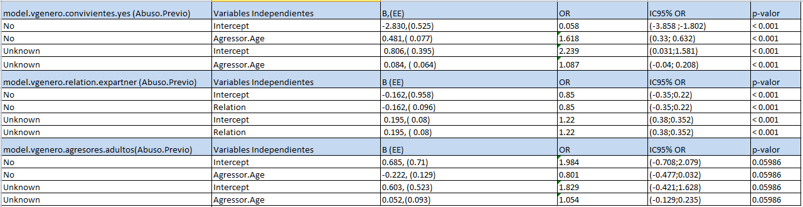

# 1 - DESCRIPCIÓN ACTIVIDAD

El objetivo de esta actividad es el tratamiento de un dataset, que puede ser el creado en la práctica 1 o bien estar disponible en Kaggle. En nuestro caso se trata de un dataset disponible en ***https://data.world/  https://data.world/pablosdt/domestic-violence-in-spain***, y trata sobre la violencia de género en España.


# 1.1 - OBJETIVOS


- Aprender a aplicar los conocimientos adquiridos y su capacidad de resolución de problemas en 
  entornos nuevos o poco conocidos dentro de contextos más amplios o multidisciplinares.

- Saber identificar los datos relevantes y los tratamientos necesarios (integración, limpieza y 
  validación) para llevar a cabo un proyecto analítico.

- Aprender a analizar los datos adecuadamente para abordar la información contenida en los datos.

- Identificar la mejor representación de los resultados para aportar conclusiones sobre el problema 
  planteado en el proceso analítico.

- Actuar con los principios éticos y legales relacionados con la manipulación de datos en función del 
  ámbito de aplicación.

- Desarrollar las habilidades de aprendizaje que permita continuar estudiando de un modo que tendrá 
   que ser en gran medida autodirigido o autónomo.

- Desarrollar la capacidad de búsqueda, gestión y uso de información y recursos en el
  ámbito de la ciencia de datos.


# 1.2 - COMPETENCIAS

En esta práctica se desarrollan las siguientes competencias del Master de Data Science:

- Capacidad de analizar un problema en el nivel de abstracción adecuado a cada situación y aplicar las habilidades y conocimientos adquiridos para abordarlo y resolverlo.

- Capacidad para aplicar las técnicas específicas de tratamiento de datos (integración, transformación, limpieza y validación) para su posterior análisis.


# 2 - RESOLUCIÓN

# 2.1 - DESCRIPCIÓN DEL DATASET / IMPORTANCIA

El dataset elegido contiene información sobre casos de mujeres asesinadas en España, por sus parejas o ex-parejas, entre los años 2003 y 2017. Los datos provienen de la web de estadística de la violencia de género en España  http://estadisticasviolenciagenero.igualdad.mpr.gob.es/

El dataset está formado por 10 características (columnas) que presentan 900 sucesos (filas o registros):


- Year (integer)
- Month (Text)
- Autonomous Comunity (string)
- Province (string)
- Victim's age group (string)
- Agressor's age group (string)
- Partner / ex partner (string)
- Cohabitation (string)
- Existence of previous police report of gender violence (string)
- Number of victims (integer)

La información contenida en el dataset es importante, ya que proporciona datos de contexto sobre los casos de asesinatos de mujeres por parte de de sus parejas o ex-parejas.

A partir de este conjunto de datos, se plantea la problemática de determinar qué variables influyen más sobre el hecho de que ya se hubiera producido algún abuso previo, mediante el análisis de las correlaciones entre el hecho de reportes de abusos previos y otras características que definen el suceso, la realización de contrastes de hipótesis que nos proporcionen relaciones interesantes inferidas de los datos de la población, como por ejemplo la cohabitación, las edades, etc. Entendemos que el hecho de que ya se hubiera producido algún abuso previo, es un factor determinante en el hecho de que dicho abuso se convierta en agresión y que esta pueda llevar al asesinato.

Este análisis puede ser de gran relevancia, ya que podria permitir a la policía determinar a partir de informes previos, que comportamiento pueden tener casos con características y/o relaciones entre ellas similares, que todavía no han acabado en fatalidad, como por ejemplo incumplimiento de órdenes de alejamiento en el caso de que el agresor y la posible víctima no convivan, agresiones previas denunciadas o recogidas por la policía, servicios sociales etc...


# 2.2 - INTEGRACIÓN Y SELECCIÓN DE DATOS

Una vez definido el objetivo, creemos que las características más relevantes a considerar son:

***Year***

  De cara a poder obtener información de progresión del número de casos en el tiempo, con el objetivo de evaluar si las políticas de prevención que se estén aplicando están dando   resultado o no. No es el caso, pero esta característica podría ser determinante en un futuro, cuando se disponga de información de estos sucesos durante los periodos de         confinamiento provocados por el COVID.

***Month / Autonomous Comunity***
 
  Es sabido que la época del año y la localización, determinan factores ambientales, como el excesivo calor, que facilitan las reacciones violentas en determinadas personas. Otros   factores desencadenantes de agresiones previas pueden ser el nivel de desempleo en la zona, desahucios, etc...    

***Victim's age group / Agressor's age group / Partner - Ex Partner / Cohabitation***

  Este grupo de características nos ayudarán también a establecer las correlaciones y pruebas de hipótesis en relación con la característica principal del estudio. Por ejemplo, en   que grado determina la edad del agresor, el hecho de que haya habido algún informe de violencia previo. Los comportamientos machistas, que pueden acabar en agresiones extremas,   se extienden cada vez más a poblaciones más jóvenes. 

***Previous abuse report***

  Característica principal del estudio
  
  
Por lo que las columnas del fichero que utilizaremos para nuestro estudio son:

***Month, Year, Autonomous Community, Relation, Victim Age, Agressor Age, Previous Abuse Report, Living Together***

Descartando la provincia y el número de víctimas, ya que entendemos que no son necesarias para el estudio.


# 2.3 - LIMPIEZA DE LOS DATOS

Se realiza una inspección prelminar del archivo mediante Excel, donde, de entrada, no se observan valores vacíos, ni otro tipo de información que pueda ser problemática. El archivo csv viene separado por comas.

Hacemos la carga de las librerías necesarias:

```{r results='asis', echo=FALSE, include=FALSE,}

# Cargamos las librerías necesarias

if (!require("dplyr")) {
   install.packages("dplyr")
   library(dplyr)
}


if (!require("ggplot2")) {
   install.packages("ggplot2")
   library(ggplot2)
}


if (!require("nnet")) {
   install.packages("nnet")
   library(nnet)
}


if (!require("tidyverse")) {
   install.packages("tidyverse")
   library(tidyverse)
}

if (!require("regclass")) {
    install.packages("regclass")
   library(regclass)
}

if (!require("vcd")) {
    install.packages("vcd")
   library(vcd)
}

if (!require("XNomial")) {
    install.packages("XNomial")
   library(XNomial)
}

```


```{r,eval=TRUE,echo=TRUE}

# Lectura de los datos

ViolenciaGenero <- read.csv("GenderViolenceSpain.csv", sep =",", header = TRUE)

head(ViolenciaGenero)


```

```{r,eval=TRUE,echo=TRUE}

# Tipos de datos asignados a cada campo

sapply(ViolenciaGenero, function(x) class(x))


```

Comprobamos que los tipos proporcinados para cada columna coinciden con los del dataset.


## 2.3.1 - Selección de los datos de interes

Siguiendo el criterio establecido en el apartado 2.2, vamos a eliminar del datset las columnas ***Victims*** y ***Province***:


```{r,eval=TRUE,echo=FALSE}


# Eliminamos las columnas Province y Victims

ViolenciaGenero <- select(ViolenciaGenero,-Province, -Victims)


```


## 2.3.2 - Ceros y elementos vacíos

Vamos a comprobar si tenemos ceros y/o elementos vacíos

```{r,eval=TRUE,echo=TRUE}


# Comprobamos valores NA y nulos


sapply(ViolenciaGenero, function(x) sum(is.na(x)))

sapply(ViolenciaGenero, function(x) sum(is.null(x)))


```


## 2.3.3 - Identificación y tratamiento de outliers

Un outlier es una observación anormal y extrema en una muestra estadística o serie temporal de datos, que puede afectar potencialmente a la estimación de los parámetros del mismo.
En nuestro caso, la única variable numérica es el año, por lo que no aplica la identificación de outliers.

Pero hemos comprobado que sólo hay un registro donde la variable Previous.Abuse.Report = 'Ex-officio'. Esto puede llevarnos a valores cero dentro de las tablas de contingencia y tests que realizaremos más tarde, por lo que podemos considerarlo como un "outlier", por lo que decidimos que es oportuno eliminar dicho registro.


```{r results='asis', echo=FALSE, include=FALSE,}


# Eliminamos el registro con la variable Previous.Abuse.Report = 'Ex-officio'

ViolenciaGenero[ViolenciaGenero$Previous.Abuse.Report != "Ex-officio", ]

ViolenciaGenero <- ViolenciaGenero[!(ViolenciaGenero$Previous.Abuse.Report == 'Ex-officio'),]


```


## 2.3.4 - Exportación de los datos preprocesados

Exportamos los datos preprocesados a un fichero .csv

```{r,eval=TRUE,echo=TRUE}

# Exportación de los datos preprocesados a un fichero .csv

write.csv(ViolenciaGenero,"GenderViolenceSpain_data_clean.csv")

```


# 2.4 - ANÁLISIS DE LOS DATOS


## 2.4.1 - Factorización y niveles de las variables cuantitativas


De cara a poder estudiar la homogeneidad y la normalidad de la varianza, vamos a factorizar y convertir a valores númericos las variables cualitativas a cuantitativas categóricas.

Convertimos en factores y vemos sus niveles

```{r,eval=TRUE,echo=TRUE}

# Convertimos en factores y vemos sus niveles


levels(factor(ViolenciaGenero$Previous.Abuse.Report))

levels(factor(ViolenciaGenero$Autonomous.Community))

levels(factor(ViolenciaGenero$Month))

levels(factor(ViolenciaGenero$Relation))

levels(factor(ViolenciaGenero$Victim.Age))

levels(factor(ViolenciaGenero$Agressor.Age))

levels(factor(ViolenciaGenero$Living.Together))

```


Factorizamos los valores para cada columna

```{r,eval=TRUE,echo=TRUE}

ViolenciaGenero$Previous.Abuse.Report <- as.numeric(fct_rev(factor(ViolenciaGenero$Previous.Abuse.Report)))

ViolenciaGenero$Autonomous.Community <- as.numeric(factor(ViolenciaGenero$Autonomous.Community))

ViolenciaGenero$Month <- as.numeric(factor(ViolenciaGenero$Month))

ViolenciaGenero$Relation <- as.numeric(factor(ViolenciaGenero$Relation))

ViolenciaGenero$Victim.Age <- as.numeric(factor(ViolenciaGenero$Victim.Age))

ViolenciaGenero$Agressor.Age <- as.numeric(factor(ViolenciaGenero$Agressor.Age))

ViolenciaGenero$Living.Together <- as.numeric(factor(ViolenciaGenero$Living.Together))


```


## 2.4.2 - Selección de grupos de datos

Seleccionamos un conjunto inicial de grupos de datos que nos pueden resultar interesantes de analizar y/o comparar.

Los valores de la variable Previous.Abuse.Report han quedado así:

1: Yes
2: Unknown
3: No


**Agrupación por Comunidad Autónoma con temperaturas muy elevadas en verano**

Comunidades: Andalucía (1), Aragón (2), Región de Murcia (21), Castilla - La Mancha (5)

Meses: Junio (7), Julio (6), Agosto (2)


```{r results='asis', echo=FALSE, include=FALSE,}

ViolenciaGenero.Televada.Verano <- ViolenciaGenero %>% filter(Autonomous.Community == "1" | Autonomous.Community == "2" | Autonomous.Community == "21" | Autonomous.Community == "5", Month == 2 | Month == 6 | Month == 7 )

```

```{r,eval=TRUE,echo=TRUE}


head(ViolenciaGenero.Televada.Verano)

```


**Agrupación por agresores jóvenes  (16-17 years (2), 18-20 years(3) )**


```{r results='asis', echo=FALSE, include=FALSE,}

ViolenciaGenero.Agresores.Jovenes <- ViolenciaGenero %>% filter(Agressor.Age== "2" | Agressor.Age== "3")

```


```{r,eval=TRUE,echo=TRUE}

head(ViolenciaGenero.Agresores.Jovenes)

```


**Agrupación por agresores adultos  (21-30 years (4), 31-40 years (5), 41-50 years (6), 51-64 years (7))**


```{r results='asis', echo=FALSE, include=FALSE,}


ViolenciaGenero.Agresores.Adultos <- ViolenciaGenero %>% filter(Agressor.Age== "4" | Agressor.Age== "5" | Agressor.Age== "6" | Agressor.Age== "7")

```

```{r,eval=TRUE,echo=TRUE}

head(ViolenciaGenero.Agresores.Adultos)

```


**Agrupación por agresores mayores (65-74 (8), 74-85 (9), > 85 years (1))**


```{r results='asis', echo=FALSE, include=FALSE,}

ViolenciaGenero.Agresores.Mayores <- ViolenciaGenero %>% filter(Agressor.Age== "8" | Agressor.Age== "9" | Agressor.Age== "1")

```

```{r,eval=TRUE,echo=TRUE}

head(ViolenciaGenero.Agresores.Mayores)

```

**Agrupación por Convivientes = Yes (3)**


```{r results='asis', echo=FALSE, include=FALSE,}

ViolenciaGenero.Convivientes.Yes <- ViolenciaGenero %>% filter(Living.Together == "3")

```

```{r,eval=TRUE,echo=TRUE}

head(ViolenciaGenero.Convivientes.Yes)

```


**Agrupación por Relation = Yes (3)**


```{r results='asis', echo=FALSE, include=FALSE,}


ViolenciaGenero.Relation.Expartner <- ViolenciaGenero %>% filter(Relation == "1")


```

```{r,eval=TRUE,echo=TRUE}

head(ViolenciaGenero.Relation.Expartner)

```


## 2.4.3 - Comprobación de homogeneidad y normalidad de la varianza


## 2.4.4 - Tablas de Contingencia


En nuestro caso, todas las variables que vamos a utilizar son categóricas, por lo que el análisis de sus relaciones se ha de obtener mediante Tablas de contingencia y pruebas Chi-Cuadrado

**Tablas de Contingencia**

```{r,eval=TRUE,echo=TRUE}


TablaCAMonth.PAR <- ftable(ViolenciaGenero.Televada.Verano[, c("Autonomous.Community", "Month", "Previous.Abuse.Report")])

TablaCAMonth.PAR


```


Podemos comprobar que donde más asesinatos se producen, es en la Comunidad Andaluza (1) en los meses de Junio (7) y Julio (6), sin que haya constancia de abusos previos, seguida por Castilla La Mancha  (5) en el més de Julio (6), también sin constancia de abusos previos.


```{r,eval=TRUE,echo=TRUE}

TablaJovenes.PAR <- table(ViolenciaGenero.Agresores.Jovenes$Previous.Abuse.Report,ViolenciaGenero.Agresores.Jovenes$Agressor.Age)

TablaJovenes.PAR

```
```{r,eval=TRUE,echo=TRUE}

plot(TablaJovenes.PAR, col = c("red", "blue"), main = "Young Agressor's Age vs. Previous abuse report")

```
Podemos comprobar que el mayor número de asesinatos en jóvenes se producen en la franja de 18-20 years(3) y sin constancia de abusos previos


```{r,eval=TRUE,echo=TRUE}

TablaAdultos.PAR <- table(ViolenciaGenero.Agresores.Adultos$Previous.Abuse.Report,ViolenciaGenero.Agresores.Adultos$Agressor.Age)

TablaAdultos.PAR


```
```{r,eval=TRUE,echo=TRUE}

plot(TablaAdultos.PAR, col = c("red", "blue", "green", "cyan"), main = "Adult Agressor's Age vs. Previous abuse report")

```

Podemos comprobar que el mayor número de asesinatos en adultos se producen en las franjas  31-40 years (5), 41-50 years (6)


```{r,eval=TRUE,echo=TRUE}

TablaMayores.PAR <- table(ViolenciaGenero.Agresores.Mayores$Previous.Abuse.Report,ViolenciaGenero.Agresores.Mayores$Agressor.Age)

TablaMayores.PAR


```

```{r,eval=TRUE,echo=TRUE}

plot(TablaMayores.PAR, col = c("red", "blue","green"), main = "Old Agressor's Age vs. Previous abuse report")

```

Podemos comprobar que el mayor número de asesinatos se producen en todas las franjas de edades, especialmente en las franjas 65-74 (8) y 74-85 (9) , y sin constancia de abusos previos

```{r,eval=TRUE,echo=TRUE}

TablaConvivientes.PAR <- table(ViolenciaGenero.Convivientes.Yes$Previous.Abuse.Report,ViolenciaGenero.Convivientes.Yes$Living.Together)

TablaConvivientes.PAR


```

```{r,eval=TRUE,echo=TRUE}

 plot(TablaConvivientes.PAR, col = c("red"), main = "Living.Together.Yes vs. Previous abuse report")

```

Podemos comprobar que el mayor número de asesinatos entre convivientes Yes (3), se producen sin constancia de abusos previos


```{r,eval=TRUE,echo=TRUE}

TablaRelation.PAR <- table(ViolenciaGenero.Relation.Expartner$Previous.Abuse.Report,ViolenciaGenero.Relation.Expartner$Relation)

TablaRelation.PAR


```

```{r,eval=TRUE,echo=TRUE}

 plot(TablaRelation.PAR, col = c("red"), main = "Relation.ExtPartner vs. Previous abuse report")

```


## 2.4.5 - Aplicación de pruebas estadísticas


### 2.4.5.1 - Estudio de la Correlación / Tests Chi-Squared

Estamos tratando variables cuantitativas politómicas y nominales, por lo que el test Chi-squared resulta adecuado en algunos casos, y el test exacto de Fisher en otros
para valorar la independencia. 

La Edad de los agresores la consideramos nominal, ya que no las vamos a utilizar estableciendo relaciones de tipo mayor/menor, ni vamos a evaluar distancias entre los diferentes rangos de edades.


```{r,eval=TRUE,echo=TRUE}

#chisq.test(TablaCAMonth.PAR)

#Aplicamos Fisher, ya que al utilizar Chi-Square daba el error: "Chi-squared approximation may be incorrect".
#El problema es que la aproximación de Chi-cuadrado a la distribución del estadístico de prueba se basa en que los recuentos se distribuyen aproximadamente normalmente. Si muchos #de los recuentos esperados son muy pequeños, la aproximación puede ser pobre

fisher.test(TablaCAMonth.PAR, hybrid = TRUE,conf.level = 0.95, simulate.p.value = TRUE)


```

Como el p-value es > 0.05 no podemos rechazar la hipotésis nula que indica independencia entre las variables (casi total). Por lo tanto no existe correlación entre ellas.


```{r,eval=TRUE,echo=TRUE}


fisher.test(TablaJovenes.PAR, conf.level = 0.95, simulate.p.value = FALSE)


```

Como el p-value es > 0.05 no podemos rechazar la hipotésis nula que indica independencia entre ambas variables. Por lo tanto no existe correlación entre ellas.


```{r,eval=TRUE,echo=TRUE}

chisq.test(TablaAdultos.PAR)


```

Como el p-value es > 0.05 no podemos rechazar la hipotésis nula que indica independencia entre ambas variables. Por lo tanto no existe correlación entre ellas.


```{r,eval=TRUE,echo=TRUE}

fisher.test(TablaMayores.PAR, conf.level = 0.95, simulate.p.value = FALSE)

```

Como el p-value es > 0.05 no podemos rechazar la hipotésis nula que indica independencia entre ambas variables. Por lo tanto no existe correlación entre ellas.


```{r,eval=TRUE,echo=TRUE}

chisq.test(TablaConvivientes.PAR)


```

Como el p-value es <= 0.05 podemos rechazar al hipotésis nula que indica independencia entre ambas variables. Por lo tanto existe correlación entre ellas


```{r,eval=TRUE,echo=TRUE}

chisq.test(TablaRelation.PAR)


```

Como el p-value es <= 0.05 podemos rechazar al hipotésis nula que indica independencia entre ambas variables. Por lo tanto existe correlación entre ellas


### 2.4.5.3 - Regresión Logística (Multinomial)


En este caso tenemos una variable dependiente Previous.Abuse.Report de caracter politómica y nominal. 

Vamos a plantear modelos de regresión logística multinomial que nos permitan trabajar con los grupos de datos construídos anteriormente donde hayamos encontrado correlación entre las variables que los componen.

*Calcularemos Odds Ratios e Intervalos de Confianza:*


```{r,eval=TRUE,echo=TRUE}

# Calculamos un modelo relativo a los datos  Violencia.Convivientes.Yes


model.vgenero.convivientes.yes = multinom(Previous.Abuse.Report ~ Agressor.Age, data = ViolenciaGenero.Convivientes.Yes)


```


```{r,eval=TRUE,echo=TRUE}

# Obtenemos el summary

summary(model.vgenero.convivientes.yes)


```

La línea de coeficientes que comienza con 2 hace referencia al modelo comparando la probabilidad de que no sepamos nada sobre el informe previo, respecto a que si lo haya
La línea de coeficientes que comienza con 3 hace referencia al modelo comparando la probabilidad de que no haya informe previo, respecto a que si lo haya


Vamos a evaluar ahora los ***odds ratio***. Los ***odds*** es la razón de la probabilidad de ocurrencia de un suceso entre la probabilidad de su no ocurrencia.Vamos a ver como transformamos los coeficientes en odds ratios. En este primer modelo vamos a tratar de ser algo didáctivos y vamos a explicar en detalle su cálculo.

En esta expresión, el modelo está expresado en términos del ***log-odds*** para el modelo (2):

$$
ln({\frac{P(Y=1/X)}{1-P(Y=1/X)}}) = -2.83 + 0.481 * Agressor.Age 
$$
Si se escribe en términos de odds, se tiene:

$$
{\frac{P(Y=1/X)}{1-P(Y=1/X)}} = {\frac{e^{b_0}+ \sum_{i= 1}^{n}(b_{i}x_{i})}{1+e^{b_0}+\sum_{i= 1}^{n}(b_{i}x_{i})}}
$$
Se calculan los distintos valores de las probabilidades para las cuatro combinaciones entre la variable dependiente Y con la independiente X:

$$
{\frac{P(Y=1/X=1)}{1-P(Y=1/X=1)}} = {\frac{e^{b_0+b_1}}{1+e^{b_0+b_1}}}
$$

$$
{\frac{P(Y=1/X=0)}{1-P(Y=1/X=0)}} = {\frac{e^{b_0}}{1+e^{b_0}}}
$$

$$
{\frac{P(Y=0/X=1)}{1-P(Y=0/X=1)}} = {\frac{1}{1+e^{b_0+b_1}}}
$$

$$
{\frac{P(Y=0/X=0)}{1-P(Y=0/X=0)}} = {\frac{1}{1+e^{b_0}}}
$$

Los ***odds-ratio (OR)*** se calculan como la razón entre los ***odds***, donde la variable respuesta Y está presente entre los individuos, es decir, toma el valor Y = 1, y la variable independiente X puede estar presente o no, es decir, tomar los valores X = 1 y X = 0.

$$
OR = {\frac{{\frac{P(Y=1/X=1)}{1-P(Y=1/X=1)}}}{{\frac{P(Y=1/X=0)}{1-P(Y=1/X=0)}}}} = {e^{b_1}}
$$


• Un OR = 1 implica que no existe asociación entre la variable respuesta y la covariable.
• Un OR inferior a la unidad se interpreta como un factor de protección, es decir, el suceso es menos probable en presencia de dicha covariable.
• Un OR mayor a la unidad se interpreta como un factor de riesgo, es decir,el suceso es más probable en presencia de dicha covariable.


$$
ln({\frac{P(Y=1/X)}{1-P(Y=1/X)}}) = 0.806 + 0.084 * Agressor.Age 
$$


```{r,eval=TRUE,echo=TRUE}

# Coefcientes Modelo 

coefmodel.vgen.conv.yes <- coef(model.vgenero.convivientes.yes)

coefmodel.vgen.conv.yes

```

```{r,eval=TRUE,echo=TRUE}

# Odds Ratios Modelo 


exp(coefmodel.vgen.conv.yes)


```


```{r,eval=TRUE,echo=TRUE}

# Intervalos de confianza odds ratio


Modelo.vgenero.conv.yes.IC <- confint(model.vgenero.convivientes.yes)

Modelo.vgenero.conv.yes.IC

```


```{r,eval=TRUE,echo=TRUE}

# Calculamos un modelo relativo a los datos  Violencia.Relation.Expartner

model.vgenero.relation.expartner = multinom(Previous.Abuse.Report ~ Relation, data = ViolenciaGenero.Relation.Expartner)


```


```{r,eval=TRUE,echo=TRUE}

# Obtenemos el summary

summary(model.vgenero.relation.expartner)


```

En este caso tenemos las siguientes ecuaciones:

$$
ln({\frac{P(Y=1/X)}{1-P(Y=1/X)}}) = -0.162 - 0.162 * Relation
$$
$$
ln({\frac{P(Y=1/X)}{1-P(Y=1/X)}}) = 0.194 - 0.194 * Relation 
$$

```{r,eval=TRUE,echo=TRUE}

# Coefcientes Modelo 

coefmodel.vgen.rel.expartner <- coef(model.vgenero.relation.expartner)

coefmodel.vgen.rel.expartner 

```

```{r,eval=TRUE,echo=TRUE}

# Odds Ratios Modelo 


exp(coefmodel.vgen.rel.expartner )


```


```{r,eval=TRUE,echo=TRUE}

# Intervalos de confianza odds ratio


Modelo.vgen.rel.expartner.IC <- confint(model.vgenero.relation.expartner)

Modelo.vgen.rel.expartner.IC 

```

***Vamos a considerar también el modelo relativo a agresores adultos, ya que su p-value estaba al límite de descartar la hipótesis nula***

```{r,eval=TRUE,echo=TRUE}

# Calculamos un modelo relativo a los datos  Violencia.Agresores.Adultos


model.vgenero.agresores.adultos = multinom(Previous.Abuse.Report ~ Agressor.Age, data = ViolenciaGenero.Agresores.Adultos)


```


```{r,eval=TRUE,echo=TRUE}

# Obtenemos el summary

summary(model.vgenero.agresores.adultos)


```

En este caso tenemos:

$$
ln({\frac{P(Y=1/X)}{1-P(Y=1/X)}}) = 0.685 - 0.222 * Agressor.Age
$$
$$
ln({\frac{P(Y=1/X)}{1-P(Y=1/X)}}) = 0.603 + 0.053 * Agressor.Age
$$
```{r,eval=TRUE,echo=TRUE}

# Coefcientes Modelo 

coefmodel.vgen.agr.adultos <- coef(model.vgenero.agresores.adultos)

coefmodel.vgen.agr.adultos 

```

```{r,eval=TRUE,echo=TRUE}

# Odds Ratios Modelo 


exp(coefmodel.vgen.agr.adultos )


```


```{r,eval=TRUE,echo=TRUE}

# Intervalos de confianza odds ratio


Modelo.vgenero.agr.adultos.IC <- confint(model.vgenero.agresores.adultos)

Modelo.vgenero.agr.adultos.IC

```


# 2.5 - REPRESENTACIÓN DE RESULTADOS

**Interpretación de Modelos**

**Tabla resumen**

```{r pressure, echo=FALSE, fig.cap="Tabla resumen modelos", out.width = '100%'} 

 

``` 

Cuando interpretamos las odds ratios de cada variable, se asume que el resto de variables independientes se mantienen fijas. Interpretaremos cada una de las
variables independientes entre los distintos tipos de Abuso.Previo tomando como referencia Abuso.Previo = Yes (1).

# 2.6 - RESOLUCIÓN DEL PROBLEMA


# REFERENCIAS


https://bookdown.org/content/2274/modelos-con-variables-cualitativas.html

https://www.usj.es/sites/default/files/tarjetas/aprendizaje/EstadisticaConceptosClave.pdf

https://biocosas.github.io/R/060_analisis_datos_categoricos.html

https://www.ccg.unam.mx/~vinuesa/R4biosciences/docs/Tema8_correlacion.html
  
https://www.cienciadedatos.net/documentos/22.2_test_exacto_de_fisher_chi-cuadrado_de_pearson_mcnemar_qcochran#(chi^2)_de_Pearson_(test_de_independencia)

https://rpubs.com/rslbliss/r_logistic_ws

https://en.wikipedia.org/wiki/Multinomial_distribution

https://rpubs.com/Joaquin_AR/220567

https://masteres.ugr.es/moea/pages/tfm1011/modelosderespuestamultinomialconraplicacionparaelestudiodeladepresionenpacientescondiscapacidad/!

http://halweb.uc3m.es/esp/Personal/personas/jmmarin/esp/Categor/Tema5Cate.pdf  (Modelos Logit para respuestas nominales)


